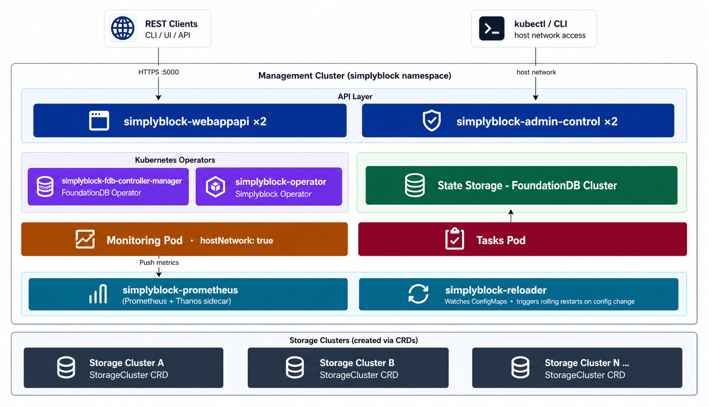

Simplyblock uses a **two-tier model**: a single **control plane cluster** acts as the control plane, and one or more
**storage clusters** run on top of it. The control plane holds all state, exposes the Management API, runs health
checks, collects metrics, and executes administrative tasks. But performs no NVMe I/O itself.

A storage class must exist in the cluster before installation. FoundationDB provisions a 10 Gi `ReadWriteOnce`
persistent volume for each of its log and storage processes. This is where all cluster state (topology, volume
metadata, task queues) is durably stored and must survive pod restarts. Prometheus similarly requires a 5 Gi
volume for its time-series data.

```bash title="Install the control plane cluster"
helm repo add simplyblock https://install.simplyblock.io/helm
helm repo update
helm upgrade --install simplyblock -n simplyblock simplyblock/spdk-csi \
    --create-namespace \
    --set operator.enabled=true
```

## Architecture Diagram



## Component Reference

| Component                            | Description                                                                                                                                                                                   |
|--------------------------------------|-----------------------------------------------------------------------------------------------------------------------------------------------------------------------------------------------|
| `simplyblock-webappapi` ×2           | The Management API on `:5000` is stateless. All state lives in FoundationDB. Pod anti-affinity across nodes.                                                                                  |
| `simplyblock-admin-control` ×2       | In-cluster control shell with `hostNetwork: true` for direct NVMe-oF access. Pod anti-affinity across nodes.                                                                                  |
| `simplyblock-fdb-controller-manager` | [FoundationDB Operator](https://github.com/FoundationDB/fdb-kubernetes-operator){:target="_blank" rel="noopener"}. Provisions, heals, and upgrades the FDB cluster.                           |
| `simplyblock-operator`               | [Simplyblock Operator](https://github.com/simplyblock/simplyblock-operator){:target="_blank" rel="noopener"}: reconciles CRDs (`StorageCluster`, `StorageNode`, `Pool`, etc.) into API calls. |
| `simplyblock-fdb-cluster-*`          | [FoundationDB](https://www.foundationdb.org/){:target="_blank" rel="noopener"} distributed key-value store. Backs all cluster state with ACID transactions. 10 Gi PV per pod.                 |
| `simplyblock-monitoring-*`           | 11-container pod (`hostNetwork: true`) collecting node health, volume I/O stats, capacity, device health, and events. Pushes metrics to Prometheus.                                           |
| `simplyblock-tasks-*`                | 13-container pod for the async task engine. Each container is a single-purpose runner for operations like node-add, migration, backup, and snapshot replication.                              |
| `simplyblock-prometheus-*`           | [Prometheus](https://prometheus.io/){:target="_blank" rel="noopener"} + [Thanos](https://thanos.io/){:target="_blank" rel="noopener"} sidecar. 5 Gi persistent storage for metrics.           |
| `simplyblock-reloader-*`             | [Stakater Reloader](https://github.com/stakater/Reloader){:target="_blank" rel="noopener"}. Watches ConfigMaps and triggers rolling restarts when the FDB connection string changes.          |

## High Availability

| Component                   | HA Mechanism                                                    |
|-----------------------------|-----------------------------------------------------------------|
| `simplyblock-webappapi`     | 2 replicas, required pod anti-affinity across nodes             |
| `simplyblock-admin-control` | 2 replicas, required pod anti-affinity across nodes             |
| FoundationDB                | 3 storage + 3 log processes; survives loss of 1 storage process |
| Monitoring / Tasks          | Single replica; task queue in FDB survives pod restarts         |
| Prometheus                  | StatefulSet with persistent volume                              |

In production deployments with 3+ control plane nodes, FDB runs in `triple` redundancy mode. Any single node can be
lost without data loss or API downtime.

## Creating Storage Clusters

The control plane ships with no storage configured. Storage clusters are added via CRDs:

```bash title="Create a storage cluster"
kubectl apply -f - <<'EOF'
apiVersion: storage.simplyblock.io/v1alpha1
kind: StorageCluster
metadata:
  name: simplyblock-cluster
  namespace: default
spec:
  mgmtIfname: eth0
  fabricType: tcp
  isSingleNode: false
  enableNodeAffinity: false
  strictNodeAntiAffinity: false
  warningThreshold:
    capacity: 80
    provisionedCapacity: 10
  criticalThreshold:
    capacity: 90
    provisionedCapacity: 50
EOF
```

The `simplyblock-operator` picks up the new resource, calls the Management API to bootstrap the cluster, and registers it
in FoundationDB. Storage nodes, pools, and volumes are then added incrementally via additional CRDs.

For next steps, see [Deploy Storage Nodes and CSI](k8s-storage-plane.md).
